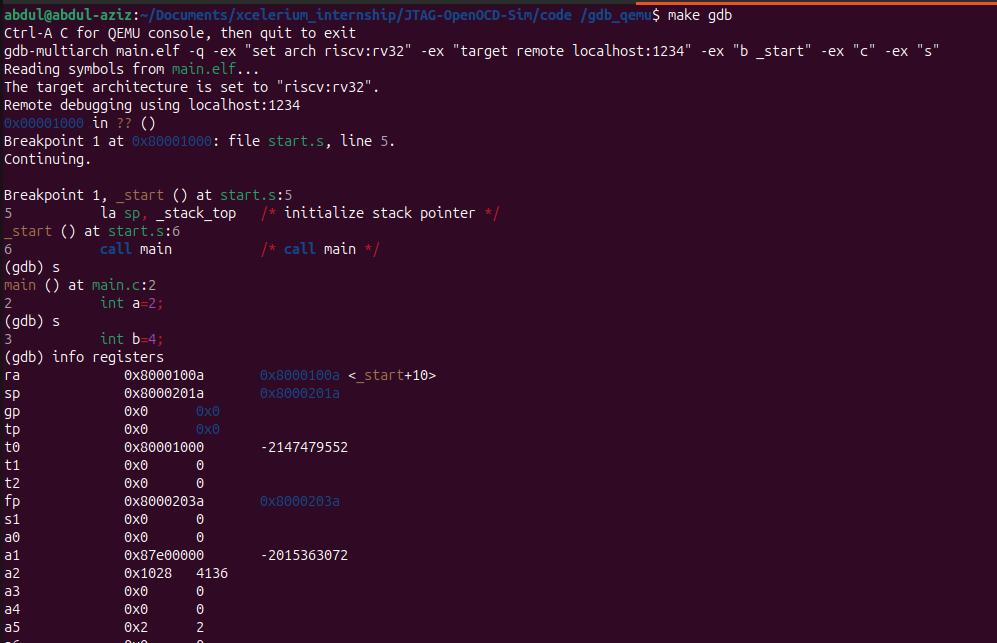

QEMU + GDB — Debugging Guide
=============================

Overview
--------
This repository contains a minimal RISC‑V firmware example (assembled in `start.s` and linked with `linker.ld`) and a simple C program (`main.c`). The Makefile builds `main.elf` and includes targets to run the image under QEMU and to connect a GDB client for interactive debugging.

Prerequisites
-------------
- A RISC‑V cross toolchain (e.g. `riscv64-unknown-elf-gcc`)
- A GDB with RISC‑V support (e.g. `gdb-multiarch` or `riscv64-unknown-elf-gdb`)
- QEMU with RISC‑V system support (`qemu-system-riscv32`)
- `make`

Build
-----
From the project directory containing the Makefile run:

```bash
make all
```

That produces `main.elf` (the firmware image) using `start.s`, `main.c`, and `linker.ld`.

Run in QEMU (start GDB server)
-----------------------------
Start QEMU using the provided Makefile target. QEMU will load `main.elf`, open a GDB server on TCP port 1234 and halt the CPU at reset so you can attach a debugger:

```bash
make qemu
```

Key QEMU options used by the Makefile:
- `-nographic -serial mon:stdio` — route serial/monitor I/O to the terminal
- `-machine virt`               — use the generic virt platform for RISC‑V
- `-s -S`                       — `-s` opens a GDB server on port 1234; `-S` keeps the CPU stopped at startup
- `-bios main.elf`              — load `main.elf` as the firmware image

Note: press Ctrl-A C in the terminal to toggle the QEMU monitor console.

Connect with GDB
----------------
You can use the Makefile's `gdb` target or start an interactive GDB session manually from another terminal.

Using the Makefile target:

```bash
make gdb
```

This invokes `gdb-multiarch` with a small script that sets the architecture, connects to the remote stub on localhost:1234, and sets a breakpoint at `_start`.



Manual GDB workflow (recommended for clarity):

```bash
gdb-multiarch main.elf
(gdb) set arch riscv:rv32
(gdb) target remote localhost:1234
(gdb) break _start       # or `break main` to stop at the C entry
(gdb) continue
```

Essential GDB commands
- `set arch riscv:rv32`     — select the correct architecture/ABI
- `target remote :1234`     — attach to QEMU's GDB server
- `break <symbol>`          — set breakpoint (e.g. `_start`, `main`)
- `continue` / `c`          — resume execution
- `next` / `n`              — step over (source-level)
- `step` / `s`              — step into (source-level)
- `si` / `ni`               — single-step one machine instruction
- `info registers`          — inspect CPU registers
- `print <var>` / `p <var>` — print C variables (requires `-g` debug info)
- `x/Nx <addr>`             — examine memory (hex words)

Notes and debugging tips
------------------------
- The Makefile compiles with `-g -O0` to enable source-level debugging and reliable local variable inspection.
- The linker and startup code define the entry point `_start`. If you set a breakpoint at `main`, GDB will stop when the C runtime reaches your `main()` function.
- If local variables do not display, ensure the compiler emitted debug information (`-g`) and optimization is disabled (`-O0`).

Troubleshooting
---------------
- QEMU not found: install a QEMU package that provides `qemu-system-riscv32` or add it to your PATH.
- GDB missing RISC‑V support: use `gdb-multiarch` or the RISC‑V-specific GDB from your toolchain.
- Port 1234 unavailable: either free the port or run QEMU with a different GDB port using `-gdb tcp::PORT` and connect GDB to that port.

Files of interest
-----------------
- `start.s`   — runtime startup assembly and `_start` symbol
- `linker.ld` — linker script that places sections and defines memory layout
- `main.c`    — example C program used for the demo
- `Makefile`  — build targets: `all`, `qemu`, `gdb`, `clean`

Cleaning
--------
```bash
make clean
```

Further reading
---------------
- QEMU RISC‑V system emulation documentation
- GDB manual (remote debugging and target-specific notes)

If you would like, I can also:
- add a small GDB command script for common breakpoints and register dumps, or
- demonstrate a sample interactive debug session and include annotated screenshots.
